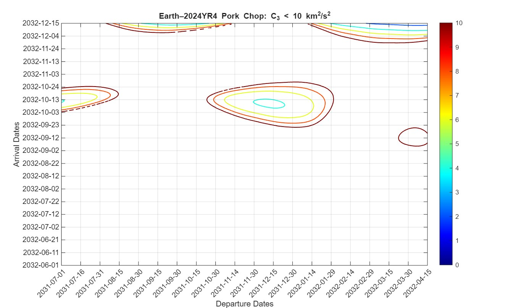
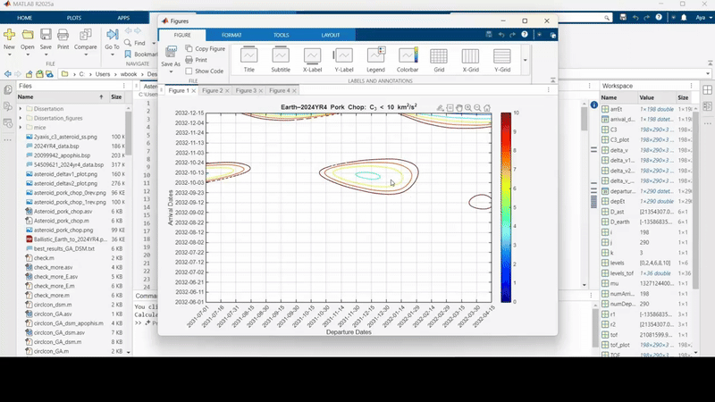
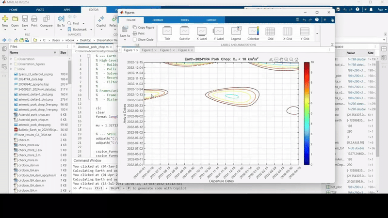
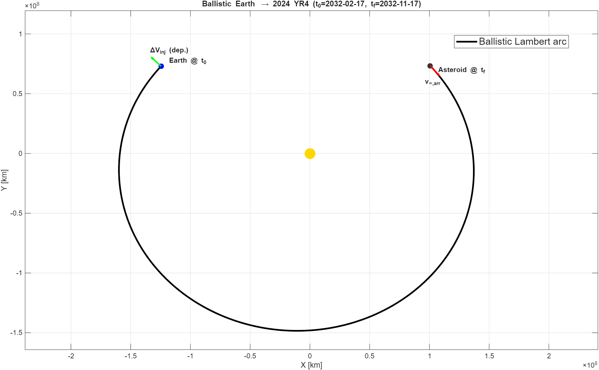
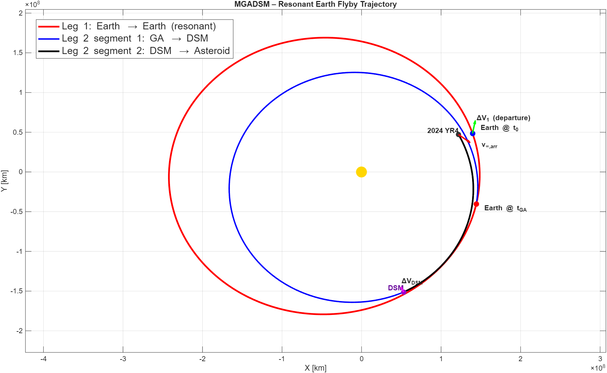
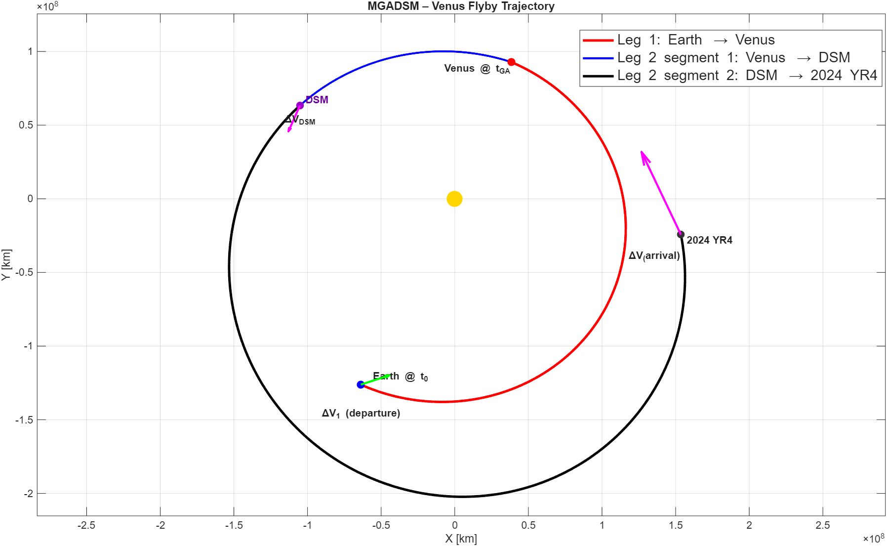

# Trajectory-Design-and-Optimization-for-a-Flyby-Mission-to-Asteroid-2024-YR4-RESULTS

This section presents the results of the mission analysis for a flyby of Asteroid 2024 YR4. The analysis begins with the verification of the Lambert solver implementation via an Earth-Mars transfer pork-chop plot benchmark. Further results include:
* Launch Window Visualization: Earth-2024 YR4 pork-chop plots for identifying optimal departure dates4.
* Interactive Visualisations: GIFs demonstrating the relationship between pork-chop plot selection and 3D trajectory geometry5.
* Optimised Mission Architectures: Direct transfer solutions and MGADSM trajectories, utilising Earth and Venus gravity assists.
* Numerical Validation: Command window outputs providing a detailed look at optimisation results.

### Lambert Solver Validation: 
The Lambert solver MATLAB implementation was validated using Earth-Mars porkchop plots for the period between the years 2005 and 2007. This ensured that any later use of the solver is validated.

| My MATLAB Implementation | NASA/Reference Benchmark |
| :---: | :---: |
|  |  |
| *Validation of Lambert Solver* | *Reference* |

*The reference plot was retrieved from: https://en.wikipedia.org/wiki/Porkchop_plot on 17/01/2026*

### Earth-2024 YR4 Porch-chop Plots:
The pork-chop plots for different periods and numbers of revolutions are presented in the table below.

| Period | Number of revolutions | Pork-chop Plots |
| :---: | :---: | :---: |
| 2027-2032 | 0 revolution |  |
| 2027-2032 | 1 revolution |  |
| 2031-2032 | 1 revolution |  |

### Interactive Pork-chop Plots Demonstrations:
This section presents GIF images demonstrating the interactive Earth-2024 YR4 pork-chop plots.

| Period | # of rev plotted | GIF images |
| :---: | :---: | :---: |
| 2031-2032 | 0 revolution |  |
| 2031-2032 | 1 revolution |  |

### Direct Transfer Optimisation Results:

**Command window results:**

t0=2032 FEB 17 00:00:15.108, tf=2032 NOV 17 00:00:00.000, deltav_inj=1.749 km/s, v_inf2=7.446 km/s
, arr_phase=83.870 deg  
optimized departure date
2032 FEB 17 00:00:00.000
optimized arrival date
2032 NOV 17 00:00:00.000
Best cost
    1.7491
**Ballistic Trajectory Plot**

## Multiple Gravity Assists with Deep Space Manoeuvres MGADSM Trajectories
### MGADSM-Earth Gravity Assist Results:

**Command window results of the most favourable optimisation outcomes after 50 runs of the Monotonic Basin Hopping MBH algorithm:**
optimized_departure_date
2028 OCT 14 05:35:42.717
optimized_arrival_date
2032 NOV 07 02:54:06.519
Best eta1 achieved
         0.711567189126113

Best eta2 achieved
         0.773142863717642

Best theta_b [rad] achieved
         -1.75279421621431

Best Rperi [km] achieved
          36463.1375370251

Best cost achieved:
          3.80720065025548

         -9.72152143235832          32.5141953200582          14.0942047522174
         -10.3709421416381          28.9055786037137          12.5299564095715
         -36.0157125443822         -4.71193242227224         -2.04231714884951

         -10.3709421416381          28.9055786037137          12.5299564095715

*These last four lines of the output serve as a validation check for the number of revolutions identified by the Lambert solvers within the MGADSM optimisation framework. The initial three lines correspond to the first solver iteration, while the final line confirms the results of the second solver call.*

Checks (X): |vinf+|-|vinf-|=4.441e-16 km/s, dv0=1.741, dvDSM=2.066, dvArr=6.998, J=3.807, T1=1056.6 d, T2=428.3 d, eta1=0.712, eta2=0.773
           tGA=2031 SEP 05 19:55:59.854, tDSM=2032 AUG 01 23:02:40.016, tArr=2032 NOV 07 02:54:06.519
           norm(ceq)=0.000e+00, max(c)=2.165e-03
v∞dep=3.875, v∞GA_in=3.927, v∞arr=6.998 km/s
, arr_phase=59.924

**MGADSM-Earth Trajectory Plot**

### MGADSM-Venus Gravity Assist Results:

**Command window results of the most favourable optimisation outcomes after 50 runs of the Monotonic Basin Hopping MBH algorithm:**

optimized_departure_date
2031 MAY 27 13:09:54.871
optimized_arrival_date
2032 OCT 13 01:24:03.470
Best eta1 achieved
          0.28878413485331

Best eta2 achieved:
         0.129721037584931

Best theta_b achieved:
         -1.29904089014891

Best Rperi achieved:
          17420.1897023278

Best cost achieved:
          2.79550455871972

          24.7258492715529         -10.6665348497429          -1.6474511501297

          24.7258492715529         -10.6665348497429          -1.6474511501297

Checks (X): |vinf+|-|vinf-|=8.882e-16 km/s, dv0=1.740, dvDSM=1.055, dvArr=6.984, J=2.796, T1=145.7 d, T2=358.8 d, eta1=0.289, eta2=0.130
           tGA=2031 OCT 20 05:49:53.832, tDSM=2031 DEC 05 18:55:59.989, tArr=2032 OCT 13 01:24:03.470
           norm(ceq)=0.000e+00, max(c)=0.000e+00
v∞dep=3.873, v∞GA_in=6.581, v∞arr=6.984 km/s
, arr_phase=60.000

**MGADSM-Venus Trajectory Plot**

