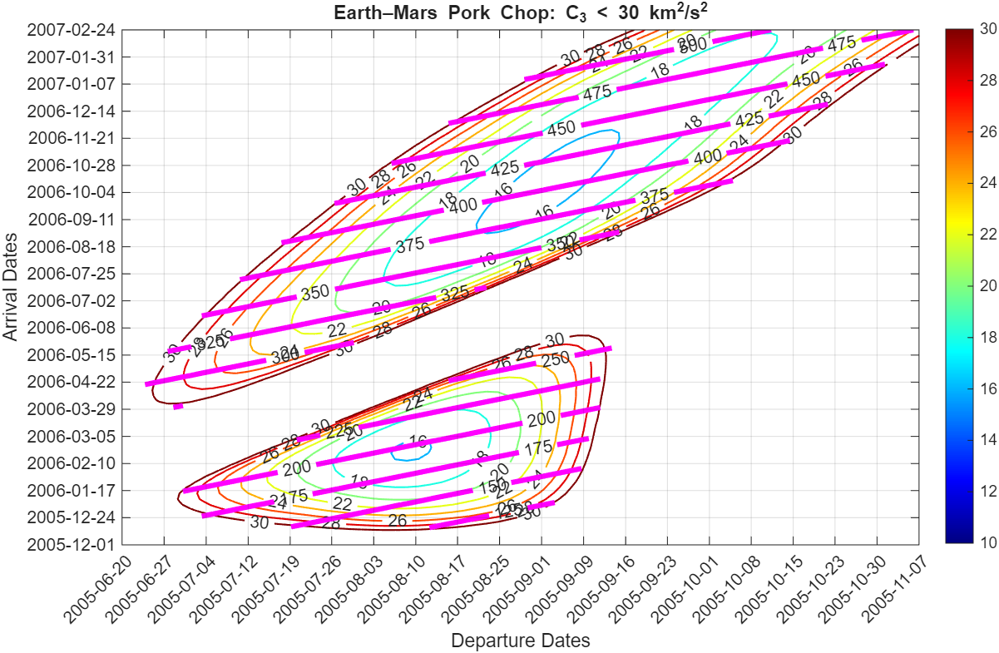
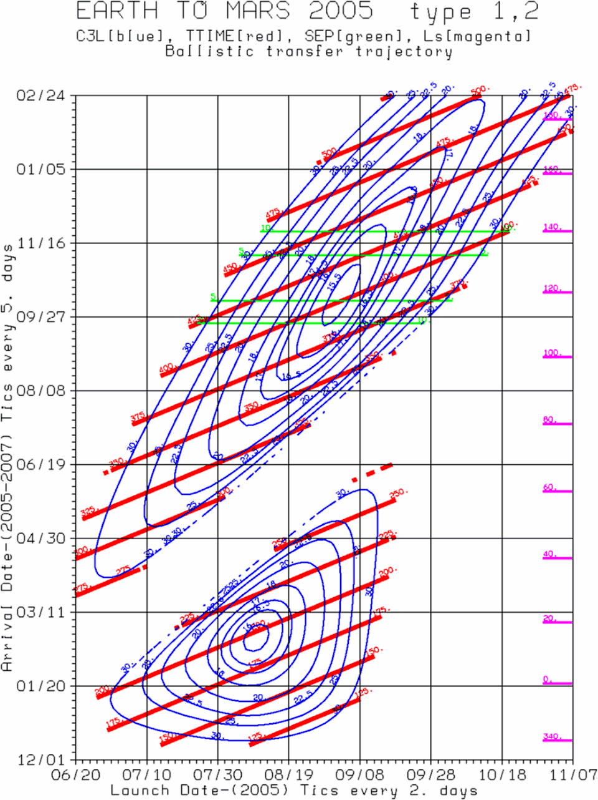
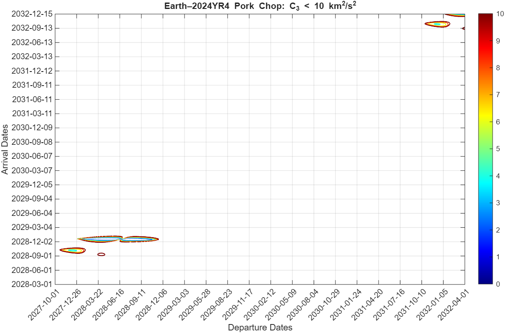
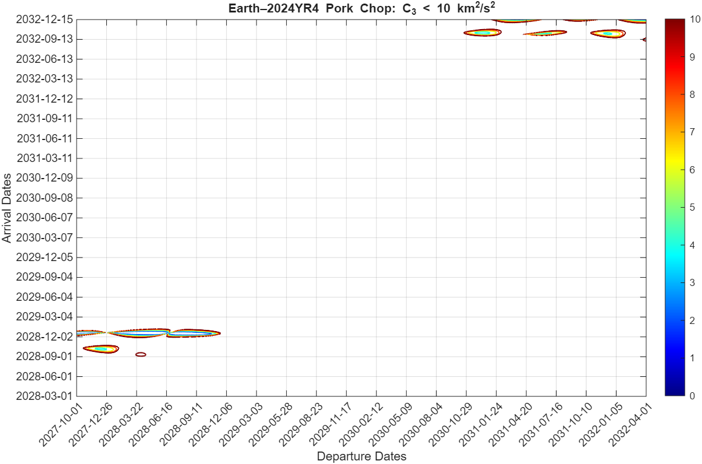

# Trajectory-Design-and-Optimization-for-a-Flyby-Mission-to-Asteroid-2024-YR4-RESULTS

This section presents the results of the mission analysis for a flyby of Asteroid 2024 YR4. The analysis begins with the verification of the Lambert solver implementation via an Earth-Mars transfer pork-chop plot benchmark. Further results include:
* Launch Window Visualization: Earth-2024 YR4 pork-chop plots for identifying optimal departure dates4.
* Interactive Visualisations: GIFs demonstrating the relationship between pork-chop plot selection and 3D trajectory geometry5.
* Optimised Mission Architectures: Direct transfer solutions and MGADSM trajectories, utilising Earth and Venus gravity assists.
* Numerical Validation: Command window outputs providing a detailed look at optimisation results.

### Lambert Solver Validation: 
The Lambert solver MATLAB implementation was validated using Earth-Mars porkchop plots for the period between the years 2005 and 2007. This ensured that any later use of the solver is validated.

| My MATLAB Implementation | NASA/Reference Benchmark |
| :---: | :---: |
|  |  |
| *Validation of Lambert Solver* | *Reference Standard* |

*The reference plot was retrieved from: https://en.wikipedia.org/wiki/Porkchop_plot on 17/01/2026*

### Earth-2024 YR4 Porch-chop Plots:
The pork-chop plots for different periods and numbers of revolutions are presented in the table below.

| Period | Number of revolutions | Pork-chop Plots |
| :---: | :---: | :---: |
| 2027-2032 | 0 revolution |  |
| 2027-2032 | 1 revolution |  |
| 2031-2032 | 1 revolution |  |
